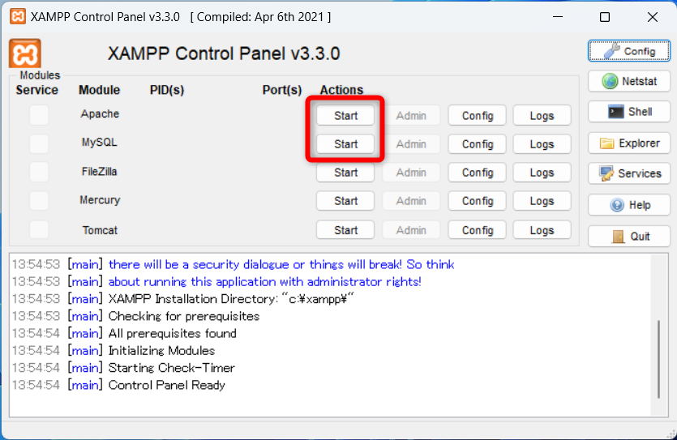
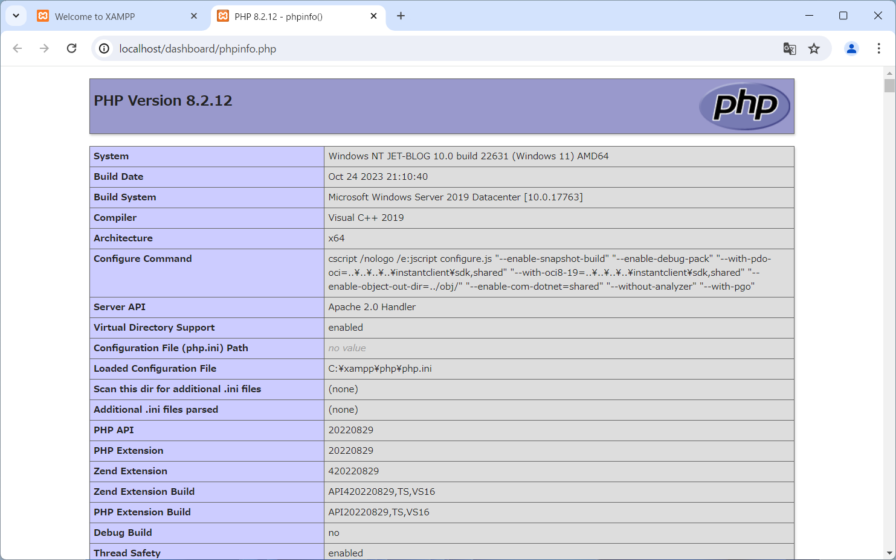
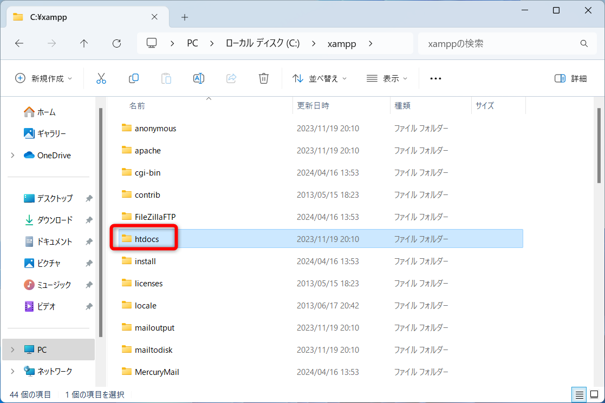
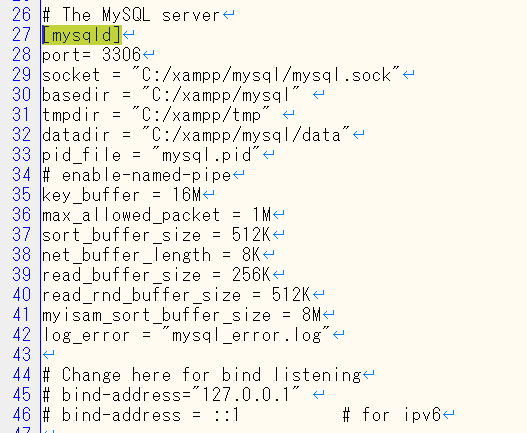
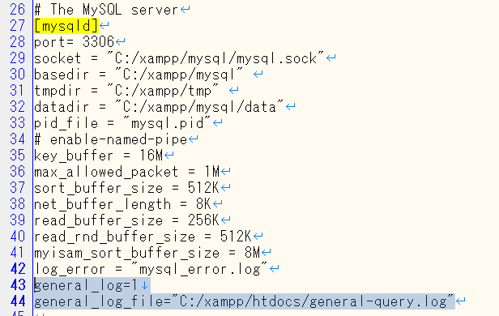

# XAMPP

## 前提条件

7-Zipがインストールされていること  
インストール方法は下記を参照

https://github.com/room202/7-zip

## インストールの手順

### ダウンロード

下記サイトからXAMPPをダウンロードする  
https://www.apachefriends.org/jp/

`その他のバージョンについては、こちらをクリックしてください`をクリック  


`More Downloads`をクリック  


`XAMPP Windows`をクリック  


`8.2.12`をクリック  


`xampp-windows-x64-8.2.12-0-VS16.zip`をクリック  


`ダウンロード`フォルダに保存する  


### インストール  

ダウンロードしたファイルを解凍(展開)する  
対象のファイルの上で`Shiftキーを押しながら右クリック`→`7-Zip`→`ここに展開`


解凍(展開)されたフォルダ`xampp`を`Cドライブ(C:\)`の真下に移動  


`C:\xampp\setup_xampp.bat`をダブルクリックで実行する  


`続行するには何かキーを押してください. . .`と表示されたら`Enterキー`を押す  
※この画面が閉じる  


## 初期設定

デスクトップにショートカットキーを作る  
`C:\xampp\xampp-control.exe`を`Shiftキーを押しながら右クリック`→`送る`→`デスクトップ(ショートカットを作成)`


デスクトップにショートカットができている事を確認する  
ショートカットができていたら、それをダブルクリックして起動する  


`Language`画面では、そのまま`Save`をクリック  


## 動作確認

XAMPP(XAMPPコントロールパネル)が起動する  
そのまま`Apache`と`MySQL`と書かれている横の`Start`ボタンをクリック  


`Apache`と`MySQL`の背景が薄い緑色になれば起動成功  


`Chrome`で下記URLにアクセスする  
http://localhost  
※URLが勝手に`http://localhost/dashboard/`になるが問題ない  
メニューにある`PHPInfo`をクリック  


このような画面になる事を確認する  


http://localhost  
に戻ってきて、`phpMyAdmin`をクリック  


このような画面になる事を確認する  


## PHPプログラムを作って動作確認

ファイルの保存先 : `C:\xampp\htdoc\php`

### PHPプログラム保存用のフォルダを作る

`C:\xampp\htdoc`フォルダの中に`php`フォルダを作る  



### PHPプログラムを作る 

作った`php`フォルダをVisual Studio Codeで開く  
`php`フォルダを`Shiftキーを押しながら右クリック`→`Codeで開く`  


`index.php`ファイルを作って、下記PHPプログラムを打ち込むかコピペする  

```php
<?php
echo "Hello World";
?>
```


`Chrome`で下記URLにアクセスする  
http://localhost/php/index.php

このような画面になればOK  


## XAMPPの終了方法

XAMPPコントロールパネルの`Apache`と`MySQL`と書かれている横の`Stop`ボタンをクリック  


`Apache`と`MySQL`の背景が灰色になればOK  
その後、右下の`Quit`ボタンでXAMPPを終了させる  


## MySQL(MariaDB)を別パソコンから接続できるようにする

### MySQL(MariaDB)ユーザーアカウントの設定変更

`‘staff’@’localhost’`

↓

`‘staff’@’%’`

### httpd-xampp.confの設定変更

別PCからphpMyAdmiにアクセスできるように設定する

`Require local`

↓

`Require all granted`

```
Alias /phpmyadmin "C:/xampp/phpMyAdmin/"
<Directory "C:/xampp/phpMyAdmin">
    AllowOverride AuthConfig
    Require local
    ErrorDocument 403 /error/XAMPP_FORBIDDEN.html.var
</Directory>
```

↓

```
Alias /phpmyadmin "C:/xampp/phpMyAdmin/"
<Directory "C:/xampp/phpMyAdmin">
    AllowOverride AuthConfig
    Require all granted
    ErrorDocument 403 /error/XAMPP_FORBIDDEN.html.var
</Directory>
```

### Windowsファイアウォールの下記ポート番号を開放

Apahce : 80

MySQL : 3306

※すでにApache(80)、MySQL(3306)が登録されていたら一旦削除する

`セキュリティが強化された Windows Defender ファイアウォール`アプリから設定可能

参考URL

https://www.fmworld.net/cs/azbyclub/qanavi/jsp/qacontents.jsp?PID=0111-2966

## `http://localhost`で表示するフォルダを変更する方法

デフォルト設定では、`http://localhost`にアクセスしたら`C:\xampp\htdocs`の内容が表示される

これを指定のフォルダ(`C:\work\php`)の内容を表示させる方法

変更対象ファイル : `C:\xampp\apache\conf\httpd.conf`  
252行目付近

```httpd.conf
DocumentRoot "C:/xampp/htdocs"
<Directory "C:/xampp/htdocs">
```

↓ に変更

```httpd.conf
DocumentRoot "C:/work/php"
<Directory "C:/work/php">
```

## `http://localhost/php`で表示するフォルダを変更する方法

`http://localhost/php`にアクセスしたら、指定のフォルダ(`C:\work\php`)の内容を表示させる方法

変更対象ファイル : `C:\xampp\apache\conf\httpd.conf`  
373行目付近に下記設定を追加

```httpd.conf
Alias /php "C:\work\php\"
<Directory "C:\work\php\">
  Options Indexes FollowSymLinks MultiViews
  AllowOverride all
  Require all granted
  Allow from all
</Directory>
```
## MySQLで実行されたSQLのログを出力

対象ファイル : `C:\xampp\mysql\bin\my.ini`

変更内容

`[mysqld]`の設定欄に下記項目を追加

```bash
general_log=1
general_log_file="C:/xampp/htdocs/general-query.log"
```

### 変更前



### 変更後


